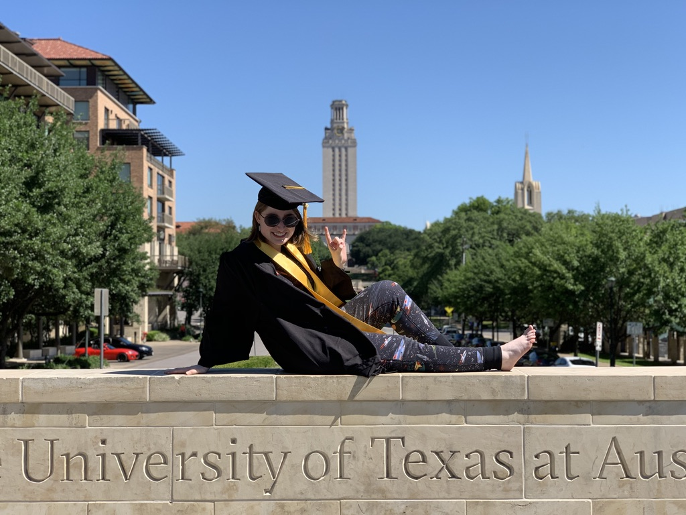
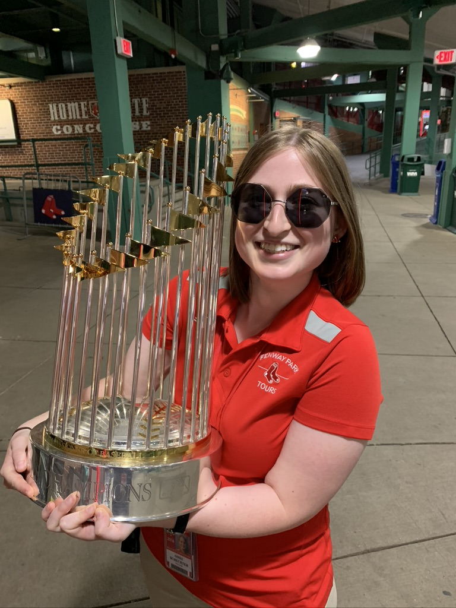

# About Me

I grew up just outside of Boston, MA before attending college at the Unversity of Texas at Austin. I am currently based in Boulder, CO working on my PhD at CU Boulder's Astrophysical and Planetary Sciences Department with Prof. Julie Comerford. 

I am a huge Red Sox fan, and love watching Texas football. I have been a Fenway Park Tour Guide since 2016, both in person and handling the virtual tours during that time. That's as close as I've come to my childhood dream of being the Red Sox statistician.

Outside of academics, I now also work at an eventing and equine psychotherapy barn with Body N Soul Equine and Nature Heals. Bringing the calming powers of horses to groups who don't otherwise have access to nature-based therapies has been a lifesaver during gradaute school, forcing me to get outside and away from my computer. I have a connemara pony, Puck, who takes up most of my free time and all of my money, but who brings me so much joy as I train him. I also love reading and doing crossword puzzles.

